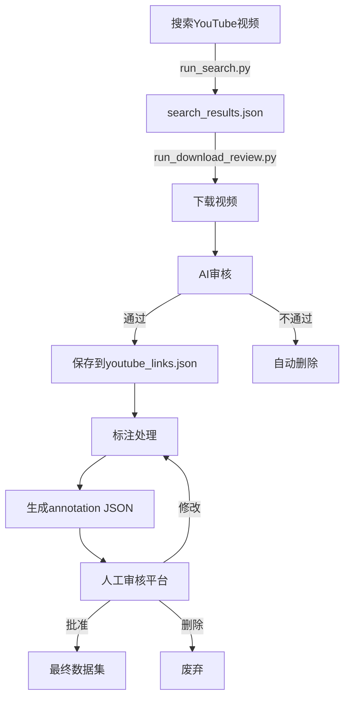

# Desire-VQA 项目架构文档

> **项目简介**: AI辅助的视频动机标注系统（Desire-VQA）
> **最后更新**: 2025-12-14
> **版本**: v3.0

---

## 📑 目录

1. [项目概览](#-项目概览)
2. [技术栈](#-技术栈)
3. [目录结构](#-目录结构)
4. [核心模块详解](#-核心模块详解)
5. [关键启动脚本](#-关键启动脚本)
6. [数据流程](#-数据流程)
7. [配置说明](#-配置说明)
8. [快速开始](#-快速开始)
9. [开发指南](#-开发指南)

---

## 🎯 项目概览

Desire-VQA 是一个用于分析视频中人物动机、渴望和行为的完整系统，采用前后端分离架构，集成了多个AI服务用于内容分析和审核。

### 核心功能

- ✅ **YouTube视频搜索与下载** - 批量搜索和下载符合条件的视频
- ✅ **AI智能审核** - 使用Gemini/OpenAI进行内容质量审核
- ✅ **视频标注** - 自动生成What/Why两层标注
- ✅ **人工审核平台** - 基于Streamlit的可视化审核系统
- ✅ **VQA问题生成** - 自动生成视觉问答问题
- ✅ **批量处理** - 支持大规模视频批处理和异步任务

---

## 🛠 技术栈

### 后端
- **FastAPI** - RESTful API框架
- **Python 3.9+** - 主要编程语言
- **Pydantic** - 数据验证和模型
- **yt-dlp** - YouTube视频下载
- **OpenCV** - 视频处理

### 前端
- **Streamlit** - Web UI框架
- **Altair/Pandas** - 数据可视化

### AI/ML
- **Google Gemini** - 主力AI模型（gemini-2.0-flash）
- **OpenAI GPT** - 备选AI模型
- **多模态分析** - 视觉语言模型（VLM）

### 数据存储
- **JSON** - 元数据和标注数据
- **文件系统** - 视频和关键帧存储

---

## 📁 目录结构

```
video_anno/
├── 🚀 主启动脚本
│   ├── main.py                          # 完整系统启动菜单
│   ├── run_reviewer.py                  # 标注审核平台启动
│   ├── annotation.py                    # 手动标注处理
│   └── batch_rename_annotations.py      # AI批量重命名
│
├── ⚙️ 配置模块 (config/)
│   ├── config.py                        # 配置管理（YAML + 环境变量）
│   ├── search_config.py                 # 搜索和审核参数
│   └── __init__.py
│
├── 🔧 后端模块 (backend/)               # 25个核心文件
│   ├── API层
│   │   ├── api.py                       # 主API (v1)
│   │   ├── api_v2.py                    # 完整API (v2, 推荐)
│   │   └── api_reviewer.py              # 审核API
│   │
│   ├── 数据模型
│   │   ├── models.py                    # 核心数据模型
│   │   ├── models_questions.py          # 问题数据模型
│   │   ├── annotation_schema.py         # 标注结构 (v1)
│   │   └── annotation_schema_v3.py      # 标注结构 (v3, 推荐)
│   │
│   ├── 核心处理
│   │   ├── vlm_analyzer.py              # VLM视频分析器
│   │   ├── content_filter.py            # AI内容审核
│   │   ├── downloader.py                # YouTube下载器
│   │   ├── video_scorer.py              # 视频评分
│   │   ├── deduplicator.py              # 去重系统
│   │   └── keyframe_strategy.py         # 关键帧提取
│   │
│   ├── 标注处理
│   │   ├── annotation_pipeline.py       # 标注流水线
│   │   ├── question_generator.py        # 问题生成
│   │   └── prompt_loader.py             # Prompt加载器
│   │
│   ├── AI提供商 (ai_providers/)
│   │   ├── base_provider.py             # 抽象基类
│   │   ├── gemini_provider.py           # Google Gemini
│   │   ├── openai_provider.py           # OpenAI
│   │   └── prompt_templates.py          # Prompt模板
│   │
│   ├── 功能模块
│   │   ├── batch_processor.py           # 批量处理
│   │   ├── user_manager.py              # 用户管理
│   │   ├── video_processor_v2.py        # 视频处理
│   │   ├── related_video_expander.py    # 相关视频扩展
│   │   ├── vqa_processor.py             # VQA处理
│   │   └── vqa_lightweight.py           # 轻量级VQA
│   │
│   ├── Prompts定义 (prompts/)
│   │   ├── content_filter_prompts.yaml
│   │   ├── video_analysis_prompts.yaml
│   │   └── ...
│   │
│   └── 测试 (tests/)
│       ├── conftest.py
│       ├── test_models.py
│       └── test_api_integration.py
│
├── 🎨 前端模块 (frontend/)              # 14个UI文件
│   ├── 核心应用
│   │   ├── app.py                       # 主应用
│   │   ├── app_verification_only.py     # 仅验证模式
│   │   └── app_complete.py              # 完整功能
│   │
│   ├── 审核平台
│   │   ├── annotation_reviewer.py       # v1
│   │   ├── annotation_reviewer_v2.py    # v2
│   │   └── annotation_reviewer_v3.py    # v3 (最新, 推荐)
│   │
│   ├── 编辑器
│   │   └── annotation_editor.py
│   │
│   ├── 组件 (components/)
│   │   ├── video_player.py              # 视频播放器
│   │   ├── keyframe_viewer.py           # 关键帧查看器
│   │   ├── question_display.py          # 问题显示
│   │   ├── question_verification.py     # 问题验证
│   │   └── annotation_editor.py         # 标注编辑
│   │
│   └── 工具 (utils/)
│       ├── api_client.py                # API客户端
│       ├── cache.py                     # 缓存管理
│       └── helpers.py                   # 辅助函数
│
├── 📜 脚本模块 (scripts/)               # 30+ 工具脚本
│   ├── 搜索和下载
│   │   ├── run_search.py                # ⭐ YouTube搜索
│   │   ├── run_download_review.py       # ⭐ 下载和审核
│   │   ├── youtube_collector.py
│   │   ├── safe_download.py
│   │   ├── auto_expands.py              # 自动扩展相关视频
│   │   └── auto_expands_v3.py
│   │
│   ├── 标注处理
│   │   ├── annotate_with_v3.py
│   │   ├── batch_annotate.py
│   │   └── annotation_stats.py
│   │
│   ├── 修复和检查
│   │   ├── check_and_fix_videos.py
│   │   ├── check_video_integrity.py
│   │   ├── repair_missing_videos.py
│   │   ├── recheck_videos.py
│   │   └── simple_repair.py
│   │
│   ├── 标签处理
│   │   ├── label_normalizer.py
│   │   ├── hybrid_label_clustering.py
│   │   ├── smart_label_clustering.py
│   │   └── smart_cluster.py
│   │
│   └── 其他工具
│       ├── show_scorer_stats.py
│       ├── compare_methods.py
│       ├── advanced_visualization.py
│       ├── test_search_and_review.py
│       ├── run_async.py
│       └── run_async_clean.py
│
├── 💾 数据模块 (data/)
│   ├── Youtube_videos/                  # 下载的视频文件
│   ├── annotations_test/                # ⭐ 测试标注文件
│   ├── annotations_backup/              # 标注备份
│   ├── keyframes/                       # 关键帧图片
│   ├── questions/                       # VQA问题
│   ├── users/                           # 用户数据
│   ├── vqa_light/                       # 轻量级VQA数据
│   │
│   └── JSON数据库
│       ├── youtube_links.json           # 已下载视频库
│       ├── search_results.json          # 搜索结果
│       ├── searched_history.json        # 搜索历史
│       └── review_status.json           # 审核状态
│
├── 📚 文档 (docs/, doc/)
│   ├── 使用指南
│   ├── 实现计划
│   └── README文件群
│
├── 📦 发布版本 (releases/)
│   ├── video_annotation_full_20251205/
│   └── video_annotation_v3_lite_20251205/
│
└── 🔑 环境配置
    ├── .env.example                     # 环境变量示例
    ├── .env                             # 实际环境变量
    ├── requirements.txt                 # Python依赖
    ├── pytest.ini                       # 测试配置
    └── .gitignore
```

---

## 🔍 核心模块详解

### 1. 配置模块 (config/)

#### config.py
- **功能**: 统一配置管理
- **特性**:
  - 从 `config.yaml` 加载配置
  - 支持环境变量覆盖
  - 点号访问路径 (`config.get('paths.videos')`)
  - 自动验证配置完整性

#### search_config.py
- **功能**: 搜索和审核参数
- **关键参数**:
  ```python
  KEYWORD_SET = "full"                    # 关键词集合
  VIDEOS_PER_KEYWORD = 5                  # 每关键词视频数
  MIN_DURATION = 30                       # 最小时长(秒)
  MAX_DURATION = 300                      # 最大时长(秒)
  ENABLE_AI_REVIEW = True                 # 启用AI审核
  STRICT_MODE = True                      # 严格模式
  AUTO_DELETE_REJECTED = True             # 自动删除不合格视频
  AI_REVIEW_WORKERS = 2                   # 并发审核数
  ```

### 2. 后端核心模块

#### vlm_analyzer.py - VLM视频分析器
- **功能**: 使用多模态AI分析视频
- **输出**:
  - **What层**: KeyframeAction (客观描述)
  - **Why层**: MotivationAnnotation (动机分析)
- **依赖**: models.py, prompt_loader.py, Gemini API

#### content_filter.py - AI内容审核器
- **功能**: 审核视频是否符合心智理论研究标准
- **审核维度**:
  - 人物互动质量
  - 情绪表达清晰度
  - 社交情境复杂度
  - 内容适宜性
- **输出**: `{pass: bool, reason: str, confidence: float}`

#### downloader.py - YouTube下载器
- **功能**:
  - YouTube视频搜索（基于关键词）
  - 视频下载（yt-dlp）
  - 视频元数据管理
  - 去重检查
- **核心方法**:
  - `search_videos()` - 搜索视频
  - `download_from_url()` - 下载单个视频
  - `add_video_link()` - 添加到数据库

#### video_scorer.py - 视频评分器
- **功能**: 预筛选视频质量
- **评分维度**:
  - 标题相关性
  - 观看数据（观看量、点赞）
  - 时长适配性
  - 频道质量
- **输出**: 0-100分 + 推荐等级

### 3. 前端模块

#### annotation_reviewer_v3.py - 审核平台（最新版）
- **功能**: 可视化标注审核
- **特性**:
  - ✅ 修复HTML渲染问题
  - ✅ 支持视频片段播放（指定时间范围）
  - ✅ 实时审核状态保存
  - ✅ 批量操作支持
- **审核操作**:
  - ✅ Approve - 批准
  - ⚠️ Needs Modification - 需要修改
  - ❌ Delete - 删除
  - 💬 Add Note - 添加备注

#### components/ - 可复用组件
- **video_player.py**: 视频播放器（支持时间范围）
- **question_verification.py**: 问题验证组件
- **keyframe_viewer.py**: 关键帧查看器
- **annotation_editor.py**: 标注编辑器

---

## 🚀 关键启动脚本

### 主启动脚本对比

| 脚本 | 功能 | 使用场景 | 命令 |
|------|------|---------|------|
| **main.py** | 完整系统启动菜单 | 普通用户交互式启动 | `python main.py` |
| **run_reviewer.py** | 审核平台启动 | 标注审核和质量控制 | `python run_reviewer.py` |
| **annotation.py** | 手动标注处理 | 处理单个视频标注 | `python annotation.py` |
| **batch_rename_annotations.py** | AI批量重命名 | 标注文件智能命名 | `python batch_rename_annotations.py` |

### 常用脚本命令

#### 1. 搜索视频（仅搜索，不下载）
```bash
python scripts/run_search.py --search-only
```
- **输出**: `data/search_results.json`
- **优点**: 快速预览，避免大量下载

#### 2. 下载和审核视频
```bash
# 完整流程
python scripts/run_download_review.py

# 限制数量
python scripts/run_download_review.py --limit 50

# 断点续传
python scripts/run_download_review.py --start 50 --limit 50

# 仅下载不审核
python scripts/run_download_review.py --skip-review
```

#### 3. 启动审核平台
```bash
python run_reviewer.py
```
- 选择启动模式：
  1. 完整系统（后端API + 前端）
  2. 仅前端（需要后端已启动）
  3. 仅后端（API服务）

#### 4. AI批量重命名标注文件
```bash
python batch_rename_annotations.py
```
- **功能**: 根据标注内容生成描述性文件名
- **示例**: `01133e42-8b19-4943.json` → `tense_family_dinner_fight.json`

---

## 🔄 数据流程

### 完整工作流程



### 1. 搜索和下载流程

```
Step 1: 搜索阶段
┌─────────────────────────────────────┐
│ run_search.py --search-only         │
├─────────────────────────────────────┤
│ → VideoDownloader.search_videos()  │
│ → VideoScorer.score_video()        │
│ → 保存 search_results.json          │
└─────────────────────────────────────┘
           ↓
Step 2: 下载和审核阶段
┌─────────────────────────────────────┐
│ run_download_review.py              │
├─────────────────────────────────────┤
│ → 读取 search_results.json          │
│ → 下载视频 (yt-dlp)                 │
│ → AI审核 (ContentFilter)            │
│ → 入库 (youtube_links.json)         │
│ → 自动删除不合格视频 (可选)          │
└─────────────────────────────────────┘
           ↓
Step 3: 标注阶段
┌─────────────────────────────────────┐
│ annotation.py / batch_annotate.py   │
├─────────────────────────────────────┤
│ → VLMAnalyzer分析视频               │
│ → 生成标注JSON                      │
│ → 保存到 annotations_test/          │
└─────────────────────────────────────┘
           ↓
Step 4: 人工审核阶段
┌─────────────────────────────────────┐
│ annotation_reviewer_v3.py           │
├─────────────────────────────────────┤
│ → 加载标注文件                      │
│ → 视频播放 + 标注查看                │
│ → 审核操作（批准/修改/删除）          │
│ → 保存审核状态                      │
└─────────────────────────────────────┘
```

### 2. 标注文件格式（v3版本）

```json
{
  "video_info": {
    "filename": "video.mp4",
    "duration": 120.5,
    "url": "https://youtube.com/..."
  },
  "scene_description": "两人在客厅激烈争论...",
  "keyframe_annotations": [
    {
      "timestamp": 5.2,
      "action_description": "男子站起来挥舞手臂",
      "visual_context": "客厅，沙发前",
      "objects": ["沙发", "茶几", "台灯"],
      "characters": [
        {
          "id": "char_1",
          "description": "中年男子，穿蓝色衬衫",
          "position": "站在沙发旁"
        }
      ],
      "confidence": 0.95
    }
  ],
  "motivations": [
    {
      "character_id": "char_1",
      "explicit_motivation": "想要说服对方接受自己的观点",
      "implicit_desire": "希望获得尊重和认可",
      "desire_category": "esteem",
      "motivation_type": "mixed",
      "implicit_level": 4,
      "supporting_evidence": ["激动的肢体语言", "提高的音量"],
      "confidence": 0.88
    }
  ],
  "questions": [
    {
      "question_text": "男子为什么站起来？",
      "question_type": "motivation",
      "answer": "为了强调自己的观点",
      "answer_source": "implicit",
      "difficulty": 3,
      "keyframe_indices": [0]
    }
  ]
}
```

---

## ⚙️ 配置说明

### 环境变量 (.env)

```bash
# API密钥
GEMINI_API_KEY=your_gemini_api_key_here
GEMINI_MODEL=gemini-2.0-flash
OPENAI_API_KEY=your_openai_api_key_here

# 服务端口
BACKEND_PORT=8000
FRONTEND_PORT=8502

# 路径配置（可选，默认使用config.yaml）
VIDEO_DIR=data/Youtube_videos
ANNOTATION_DIR=data/annotations_test
```

### 主配置文件 (config.yaml)

```yaml
paths:
  videos: data/Youtube_videos
  annotations: data/annotations_test
  keyframes: data/keyframes
  questions: data/questions

ai:
  provider: gemini
  model: gemini-2.0-flash
  temperature: 0.7
  max_tokens: 2048

annotation:
  keyframe_interval: 5
  min_confidence: 0.7
  enable_questions: true
```

### 搜索配置 (config/search_config.py)

**关键参数说明:**

```python
# 关键词集合
KEYWORD_SET = "full"  # 选项: "full", "minimal", "extended"

# 搜索数量
VIDEOS_PER_KEYWORD = 5  # 每个关键词搜索的视频数

# 视频过滤
MIN_DURATION = 30       # 最小时长（秒）
MAX_DURATION = 300      # 最大时长（秒）
MIN_VIEWS = 1000        # 最小观看量

# AI审核
ENABLE_AI_REVIEW = True         # 是否启用AI审核
STRICT_MODE = True              # 严格审核模式
AUTO_DELETE_REJECTED = True     # 自动删除不合格视频
AI_REVIEW_WORKERS = 2           # 并发审核数量

# 搜索策略
MAX_SEARCH_ATTEMPTS = 8         # 每个关键词最大尝试次数
SEARCH_DELAY = 2                # 搜索间隔（秒）
```

---

## 🚦 快速开始

### 1. 安装依赖

```bash
# 创建虚拟环境
python -m venv venv

# 激活虚拟环境
# Windows
venv\Scripts\activate
# Linux/Mac
source venv/bin/activate

# 安装依赖
pip install -r requirements.txt
```

### 2. 配置环境

```bash
# 复制环境变量示例
cp .env.example .env

# 编辑 .env，填入你的API密钥
# 至少需要配置 GEMINI_API_KEY
```

### 3. 完整工作流示例

```bash
# Step 1: 搜索视频（建议先不下载）
python scripts/run_search.py --search-only

# Step 2: 查看搜索结果
cat data/search_results.json | head -n 50

# Step 3: 下载并审核前50个视频
python scripts/run_download_review.py --limit 50

# Step 4: 对合格视频进行标注
python annotation.py

# Step 5: 启动审核平台，进行人工审核
python run_reviewer.py

# Step 6: 重命名标注文件（可选）
python batch_rename_annotations.py
```

---

## 🛠 开发指南

### 项目依赖关系

```
配置层
  ↓
数据模型层 (models.py, annotation_schema_v3.py)
  ↓
AI提供商层 (ai_providers/)
  ↓
核心处理层 (vlm_analyzer, content_filter, downloader)
  ↓
API层 (api_v2.py, api_reviewer.py)
  ↓
前端层 (annotation_reviewer_v3.py)
```

### 核心导入示例

```python
# 配置
from config.config import config

# 数据模型
from backend.models import VideoAnnotation, KeyframeAction, MotivationAnnotation

# AI分析
from backend.vlm_analyzer import VLMAnalyzer
from backend.content_filter import ContentFilter

# 下载和搜索
from backend.downloader import VideoDownloader

# AI提供商
from backend.ai_providers.gemini_provider import GeminiProvider
```

### 添加新的AI提供商

1. 在 `backend/ai_providers/` 创建新文件
2. 继承 `BaseProvider` 类
3. 实现必需方法：
   - `generate_text()`
   - `generate_structured()`
   - `analyze_video()`

```python
from .base_provider import BaseProvider

class NewAIProvider(BaseProvider):
    def __init__(self, api_key: str):
        super().__init__(api_key)
        # 初始化你的AI客户端

    def generate_text(self, prompt: str, **kwargs) -> str:
        # 实现文本生成
        pass

    # ... 实现其他方法
```

### 测试

```bash
# 运行所有测试
pytest

# 运行特定测试
pytest backend/tests/test_models.py

# 带覆盖率报告
pytest --cov=backend --cov-report=html
```

---

## 📊 数据统计

### JSON数据库文件

| 文件 | 描述 | 示例结构 |
|------|------|---------|
| **youtube_links.json** | 已下载视频库 | `{videos: [{url, title, duration, approved, ...}]}` |
| **search_results.json** | 最新搜索结果 | `{search_time, videos, statistics}` |
| **searched_history.json** | 搜索历史 | `{url: {metadata, timestamp}}` |
| **review_status.json** | 审核状态 | `{annotation_id: {status, note, timestamp}}` |

### 文件存储路径

| 目录 | 内容 | 更新时机 |
|------|------|---------|
| `data/Youtube_videos/` | 下载的视频文件 | 下载时 |
| `data/annotations_test/` | 标注JSON文件 | 标注时 |
| `data/annotations_backup/` | 标注备份 | 修改前 |
| `data/keyframes/` | 关键帧图片 | 分析时 |
| `data/questions/` | VQA问题 | 问题生成时 |

---

## 🎯 最佳实践

### 1. 搜索和下载

✅ **推荐流程**:
```bash
# 先搜索，后下载
python scripts/run_search.py --search-only
python scripts/run_download_review.py --limit 100
```

❌ **不推荐**:
```bash
# 直接搜索+下载（可能浪费大量时间在不合格视频上）
python scripts/run_search.py
```

### 2. AI审核

- **启用严格模式**: `STRICT_MODE = True` 确保数据质量
- **合理设置并发数**: `AI_REVIEW_WORKERS = 2-4`（根据API限额）
- **开启自动删除**: `AUTO_DELETE_REJECTED = True` 节省存储空间

### 3. 标注审核

- **使用最新版本**: `annotation_reviewer_v3.py`
- **定期备份**: 审核前会自动备份到 `annotations_backup/`
- **添加备注**: 对于"需要修改"的标注，务必添加具体备注

### 4. 性能优化

- **批量处理**: 使用 `batch_annotate.py` 而非单个处理
- **异步处理**: 大规模任务使用 `scripts/run_async.py`
- **缓存管理**: 定期清理临时文件和缓存

---

## 📞 常见问题

### Q: 如何更换AI模型？

A: 修改 `.env` 文件:
```bash
GEMINI_MODEL=gemini-2.0-flash  # 或其他模型
```

### Q: 如何调整视频时长限制？

A: 修改 `config/search_config.py`:
```python
MIN_DURATION = 30   # 最小30秒
MAX_DURATION = 600  # 最大10分钟
```

### Q: 审核平台无法加载视频？

A: 检查:
1. 视频文件是否存在于 `data/Youtube_videos/`
2. 标注JSON中的 `filename` 是否正确
3. 使用 `annotation_reviewer_v3.py`（v3修复了视频加载问题）

### Q: 如何批量重命名标注文件？

A: 运行:
```bash
python batch_rename_annotations.py
```
系统会调用AI分析标注内容，生成描述性文件名。

---

## 📝 更新日志

### v3.0 (2025-12-14)
- ✅ 重构审核平台（annotation_reviewer_v3）
- ✅ 修复HTML渲染和视频播放问题
- ✅ 新增批量重命名功能
- ✅ 优化搜索和下载流程
- ✅ 改进AI审核准确性

### v2.0 (2025-12-05)
- ✅ 完整发布版本
- ✅ 支持多AI提供商
- ✅ 新增VQA问题生成
- ✅ 实现批量处理

---

## 📄 许可证

本项目采用 MIT 许可证。

---

## 👥 贡献者

欢迎贡献代码和反馈！

---

**最后更新**: 2025-12-14
**维护者**: Desire-VQA Team
