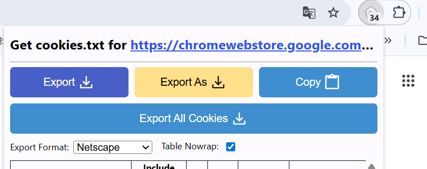

# YouTube视频搜索与AI审核系统

本代码包展示了YouTube视频自动搜索和基于VLM的内容审核流程。

## 📁 目录结构

```
code_for_review/
├── README.md                    # 本文件
├── backend/
│   ├── content_filter.py        # AI内容审核核心逻辑
│   ├── vlm_analyzer.py          # VLM (Gemini) 视频分析器
│   ├── prompt_loader.py         # 审核Prompt加载器
│   ├── youtube_search.py        # YouTube搜索API封装
│   └── prompts/
│       └── content_filter_prompts.yaml  # 审核提示词配置
├── config/
│   └── search_config.py         # 搜索和审核配置
└── scripts/
    ├── run_search.py            # YouTube搜索脚本
    └── run_download_review.py   # 下载和AI审核脚本
```

## 🔑 核心功能

### 1. YouTube视频搜索 (`youtube_search.py`)

**关键类**: `YouTubeSearcher`

**主要功能**:
- 基于关键词搜索YouTube视频
- 支持相关视频扩展（从单个视频获取相关推荐）
- 视频去重、评分、排序
- 搜索历史管理

**使用示例**:
```python
from backend.youtube_search import YouTubeSearcher

searcher = YouTubeSearcher()
results = searcher.search_videos(
    keywords=["fasting challenge", "24 hour no food"],
    max_results_per_keyword=50
)
```

### 2. AI内容审核 (`content_filter.py`)

**关键类**: `ContentFilter`

**主要功能**:
- 基于VLM的视频内容审核
- 支持三种审核模式：
  - `strict`: 严格模式（社会互动研究）
  - `standard`: 标准模式
  - `physiological_desire`: 生理需求模式（饥饿、疲劳、疼痛等）
- 并发批量审核
- JSON结构化输出

**使用示例**:
```python
from backend.content_filter import ContentFilter

filter = ContentFilter()
results = filter.batch_check(
    video_paths=["video1.mp4", "video2.mp4"],
    filter_mode="physiological_desire",
    strict_mode=False,
    max_workers=5
)
```

### 3. VLM分析器 (`vlm_analyzer.py`)

**关键类**: `VLMAnalyzer`

**主要功能**:
- 封装Google Gemini API
- 视频上传和分析
- 支持自定义prompt和响应schema

## 🎯 审核模式详解

### physiological_desire 模式

专为生理需求和二阶欲望研究设计：

**接受的内容**:
- ✅ 单人生理状态视频（疲劳、饥饿、不适）
- ✅ 挑战/耐力视频（冰桶、禁食、睡眠剥夺）
- ✅ 欲望冲突场景（抵制诱惑、意志力斗争）

**质量标准**（严格）:
- ❌ 拒绝大量字幕、花字、表情贴纸
- ❌ 拒绝综艺风格后期（分屏、反应缩放、音效文字）
- ✅ 接受简单vlog/挑战格式（时间戳可接受）

**判断标准**:
1. **视觉质量优先**: 始终先检查是否有过度后期
2. **生理标志明显**: 打哈欠、颤抖、流泪、呼吸急促等
3. **真实性**: 拒绝夸张表演，只接受真实反应

## 📊 工作流程

### 完整流程：

```
1. 搜索阶段 (run_search.py)
   └─> 关键词搜索 → 去重 → 评分 → 保存结果

2. 下载和审核阶段 (run_download_review.py)
   └─> 加载搜索结果 → 下载视频 → AI审核 → 分类存储
       ├─ 通过 → data/Youtube_videos/
       ├─ 拒绝 → 删除（可配置）
       └─ 异常 → data/ai_check_errors/
```

## ⚙️ 配置说明

### search_config.py

```python
# AI审核模式
FILTER_MODE = "physiological_desire"  # "strict" | "standard" | "physiological_desire"
STRICT_MODE = False  # True时使用更严格的审核标准

# 并发控制
AI_REVIEW_WORKERS = 5  # 并发审核数量

# 文件处理
AUTO_DELETE_REJECTED = True  # 自动删除被拒绝的视频
```

### 环境变量 (.env)

```bash
GEMINI_API_KEY=your_api_key_here
GEMINI_MODEL=gemini-2.0-flash  # 或 gemini-1.5-pro
```

## 📝 Prompt配置

审核提示词定义在 `backend/prompts/content_filter_prompts.yaml`：

- `strict`: 用于高质量社会互动研究数据
- `standard`: 标准模式
- `physiological_desire`: 生理需求模式（本项目使用）

每个模式包含：
- 详细的评判标准
- 可接受/拒绝的示例
- JSON输出schema
- 决策指南

## 🚀 使用示例

### 1. 搜索生理需求相关视频

```bash
python scripts/run_search.py
```

输出: `data/search_results.json`

### 2. 下载并审核视频

```bash
python scripts/run_download_review.py --input data/search_results.json
```

输出:
- `data/Youtube_videos/` - 通过审核的视频
- `data/youtube_links.json` - 视频元数据和审核结果

## 🎓 研究价值

### 数据质量保证

1. **视觉完整性**: 拒绝遮挡行为线索的后期元素
2. **行为可观测性**: 要求清晰的生理标志（表情、姿态、动作）
3. **真实性**: 过滤表演和夸张内容

### 适用研究领域

- 生理需求的行为表现
- 二阶欲望（欲望冲突）
- 意志力和自我控制
- 身体-心理状态映射

## 📌 注意事项

1. **API配额**: Gemini API有速率限制，建议使用 `AI_REVIEW_WORKERS=3-5`
2. **视频质量**: 优先选择清晰度高、面部可见的视频
3. **存储空间**: 视频文件较大，注意磁盘空间
4. **中途停止**: 代码支持断点续传，已处理的视频会被记录

## 📧 注意修改与配置
运行时请在根目录中放置cookies.txt文件，具体操作如下：
若爬取youtube中视频，请在edge或charme浏览器中打开youtube，保持登录状态并点开一个随机视频，安装插件Get cookies.txt LOCALLY，通常在右上方，点击export，保存为cookies.txt

按需求修改关键词，即修改search_config.py中的keywords

